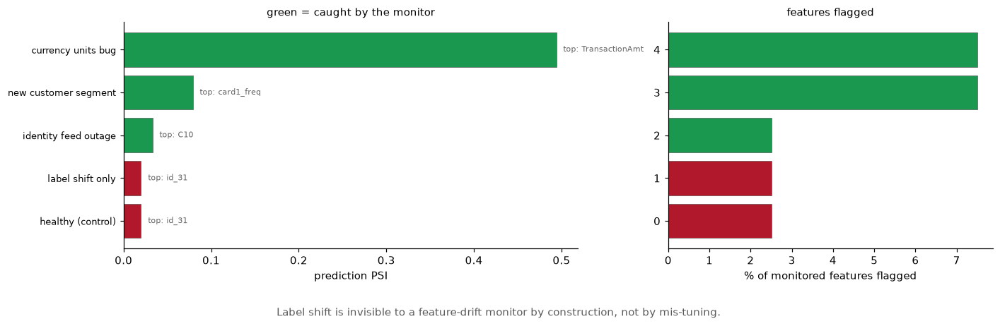
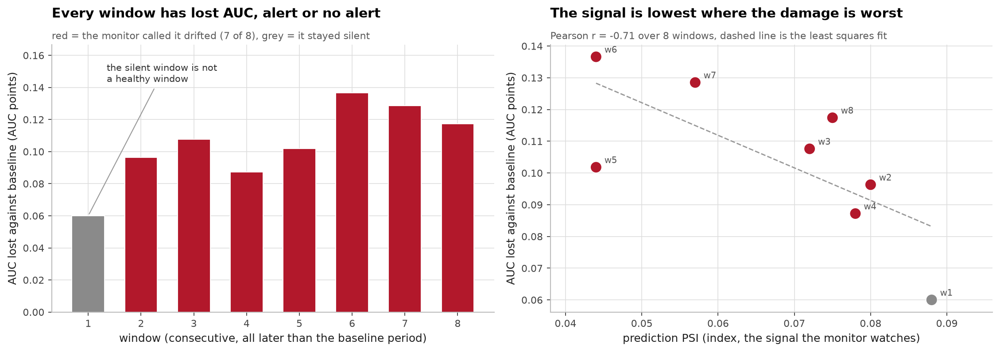
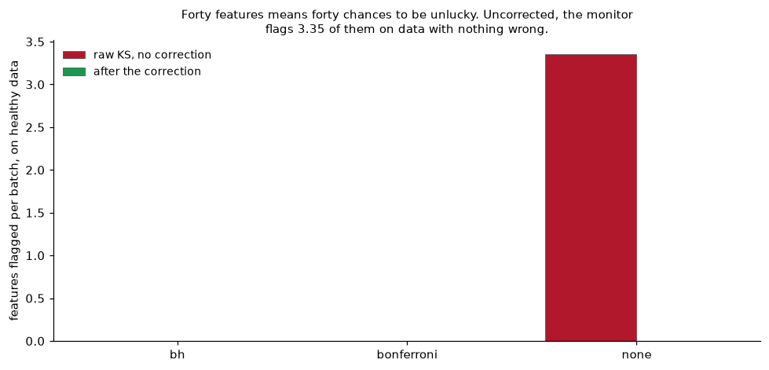
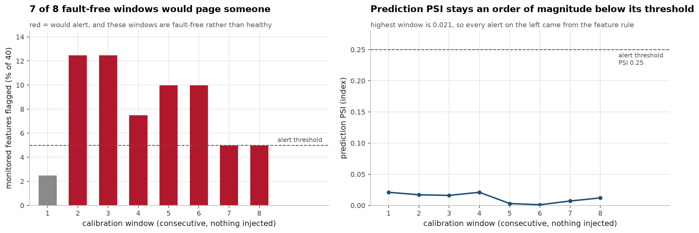
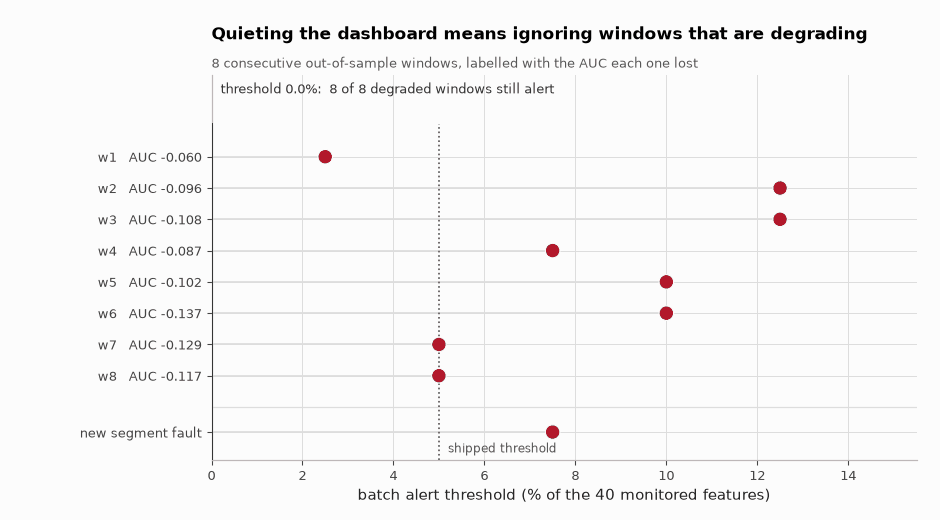

# Production ML pipeline, with the monitoring actually tested

[](https://github.com/aghasalim/mlops-fraud-pipeline/actions/workflows/ci.yml)
[](https://www.python.org/)
[](LICENSE)

The fraud model from [ieee-fraud-ml](https://github.com/aghasalim/ieee-fraud-ml)
served behind FastAPI, versioned, gated by CI, and monitored, built by a
third-year Applied Computer Science (AI) student.

A monitoring dashboard nobody has broken on purpose is a decorative chart. So
the deliverable here is **[INCIDENT.md](INCIDENT.md)**: what I broke, what the
monitor caught, and what it missed until I fixed it.

---


---

## Abstract

A fraud model behind FastAPI with CI gating and drift monitoring, and an
evaluation of whether the drift monitoring is worth having.

Three failure scenarios are injected into the serving data and the monitor
catches all three. Two controls run beside them, an untouched batch and a pure
label shift, and neither is flagged, so no false alarms. The label-shift control
is the informative one: it changes which transactions are fraudulent without
touching any input distribution, so a monitor watching features is structurally
blind to it, and no threshold setting fixes that.

More awkwardly, over eight held-out windows the correlation between the drift
signal and the actual AUC degradation is **negative**, about −0.71. The window
with the largest degradation has one of the lowest PSI values; the window with the
highest PSI has the smallest drop. On this data the signal points the wrong way,
which is worth knowing before it is wired to a pager.

The false alarms are controlled, but not by the mechanism I built for them.
Forty features tested per batch is forty chances to be unlucky, and a bare KS
test flags 3.35 features per batch on healthy data. The PSI effect-size gate is
what removes those: with the gate on and no correction at all, healthy batches
flag 0.0 features. Benjamini-Hochberg and Bonferroni sit at 0.0 too, so on this
data they have nothing left to do. Finding 2 in section 1 has the detail.

**Contributions.** (i) Injected-failure scenarios with the misses reported rather
than tuned away. (ii) A direct comparison of the drift signal against measured
degradation. (iii) A healthy control quantifying the false-alarm rate. (iv) A
deployment gate that blocks on model checks rather than on a metric threshold.

---

The baseline profile is not committed. It holds a 20,000 row reference sample
of IEEE-CIS features, and that competition data is not mine to redistribute, so
`artifacts/baseline.json` is gitignored and rebuilt from your own copy of the
raw csvs. Serving runs without it, monitoring does not.

## 1. The short version

**3 of 3 injected failures caught, 0 false alarms on 2 controls.** That is the
result the brief asks for, and it is the least interesting thing I found.

The three findings I would actually want to be asked about:

**1. My detector was broken before I injected anything.** Three bugs, all found
by testing rather than reading code. The worst: I simulated the identity
provider going down, every `id_*` column arriving null, and the monitor
reported **healthy**. A KS test drops non-finite values, so a 100%-null column
has nothing left to compare and scores PSI 0. The single most conspicuous
failure in production produced a *cleaner* report than normal traffic.

**2. The multiple-testing correction I built isn't what fixes false alarms.**
On two random halves of identical data, KS testing alone flags **3.35 of 40
features**, the 5% you asked for, arriving as noise, forever. I added
Benjamini-Hochberg for it. But the thing that actually removes them is the
**PSI effect-size gate**: requiring a shift to be *large*, not merely
detectable. With that in place BH and Bonferroni have nothing left to do. I
built the correction believing it was the answer, and it wasn't.

**3. Prediction drift points the wrong way.** Across eight windows of real
traffic the model loses **0.060 to 0.137 AUC** with nothing broken, just time
passing. Prediction PSI correlates **−0.709** with that loss: the output
distribution looks most stable exactly where the model is doing worst. n=8, so
suggestive rather than conclusive, but the direction alone kills "predictions
look normal, so we're fine."

---

## 2. What the monitor did





The right-hand panel is the uncomfortable one. If the drift signal tracked
degradation these points would rise; instead they fall, at a correlation of −0.71.
A monitor whose signal is anti-correlated with the harm it exists to detect is
worse than no monitor, because it consumes attention.







*Same eight windows, and the only thing moving is the alert threshold: the
windows and the injected new segment fault stay where they are, and once the
threshold passes 7.5% the fault stops alerting too.*

| scenario | caught? | how |
|---|---|---|
| healthy (control) | **no**, correct | correct, 1/40 features, prediction PSI 0.020 |
| currency units bug | **yes** | prediction PSI **0.494** |
| new customer segment | **yes** | 3/40 features, `card1_freq` PSI 0.564 |
| identity feed outage | **yes** | `id_31` missing rate **+100%** |
| label shift only | **no**, correct | correct by construction |

The last row is a negative control and is *supposed* to be missed: it changes
only which transactions are fraudulent, leaving every input untouched. **No
input-distribution monitor can see that**, and this one doesn't. It is in the
list because a scenario set where everything gets caught tells you nothing about
where the system is blind.

The outage is caught *only* by the missing-rate rule, both the feature-share
and prediction-PSI signals sit below threshold. Without that fix it sails
through.

---

## 3. Running it

```bash
make setup && make test
```

34 tests. The drift tests encode bugs that actually shipped, so they fail if
those regress.

```bash
make serve
```

Then `curl -X POST localhost:8000/predict -H 'content-type: application/json' -d '{"TransactionAmt": 120.0}'`

Reproducing the experiments needs the IEEE-CIS data (see
[ieee-fraud-ml](https://github.com/aghasalim/ieee-fraud-ml) for the Kaggle
fetch); point `IEEE_DATA` at it:

```bash
make validate && make simulate && make dashboard
```

---

## 4. How it fits together

| piece | choice | why |
|---|---|---|
| serving | FastAPI + Pydantic | request validation is a monitoring surface: a negative amount is a 422, not a prediction |
| container | Docker, non-root, healthcheck | a process reachable from the network is the last place to run privileged |
| registry | MLflow (SQLite backend) | the file store is in maintenance mode and now raises outright |
| gate | `registry.py` exits non-zero | CI depends on the gate as a *job dependency*, not a check mark someone is trusted to read |
| drift | KS + PSI + missing-rate | significance, effect size, and the thing distribution tests are blind to |
| monitored set | top 40 by gain importance | monitoring all 443 adds noise and alert slots, not coverage |

**The deploy gate blocks, and there are tests proving it.** A gate that has only
ever returned `true` is indistinguishable from no gate, so `test_gate.py`
asserts that a model with AUC 0.60, one trained on 1,000 rows, one whose feature
count doubled, and one that fails to load are each rejected.

---

## 5. Limitations

Stated because a monitoring write-up without a limits section is marketing:

- **No labels, so no direct performance monitoring.** The most important signal
  is missing; everything here is a proxy for it, and finding 3 is evidence the
  proxy is weak.
- **Concept drift is invisible**: demonstrated by the negative control, not
  assumed.
- **Batch, not streaming.** Detection latency is one batch.
- **Training/serving skew is unguarded.** `featurize.py` re-implements
  transformations living in another repo; a shared library or feature store is
  the real fix and is not here.

Full detail, including the thresholds I set wrong in both directions before
calibrating them, in **[INCIDENT.md](INCIDENT.md)**.

## 6. Everything here is computed twice

Every number above came out of exactly one implementation.
`experiments/detector_validation.py` and `experiments/calibrate.py` write the
four CSVs in `reports/`, the figures are drawn from the same frames, and the
tables in this file and in INCIDENT.md are typed from the same printouts. So if
the correlation in the pandas were wrong, the prose, the plot and the caption
would all be wrong together and would agree with each other perfectly. Nothing
in the repository was in a position to notice.

Rerunning the experiments is not a check either: the IEEE-CIS data they read is
not mine to redistribute and is not committed here. What *is* committed is their
output, so the output is what gets recomputed. Seven implementations that share
no code read the files in `reports/` and derive the published numbers again, and
the ones that compute the same quantity have to agree.

```bash
./verify/verify.sh
```

It skips any language whose toolchain is missing and prints
`N passed, M failed, K skipped`. With all of them installed it is
**8 passed, 0 failed, 0 skipped**.

| language | what it recomputes, from which file | measured agreement |
|---|---|---|
| SQL, `verify/tables.sql` | nine aggregations over all four report files: the headline correlation, the AUC loss range, the implied baseline AUC, the window join between `calibration.csv` and `drift_vs_degradation.csv`, and whether every published share is a fortieth | 9 of 9; 21 shares are `k/40` exactly; the two window files agree on all 8 windows |
| C, `verify/correlation.c` | the Pearson correlation kernel from `drift_vs_degradation.csv`, columns resolved by name, two passes rather than the sum-of-squares shortcut | -0.709342750712445 against the published -0.709 |
| Go, `verify/gocheck/` | structural validation of every results file plus `artifacts/deploy_decision.json`, and a fourth pass at the correlation | no ragged rows, duplicate columns, empty cells, NaN, Inf or out-of-range proportions in 4 files; 0 cross-file disagreements |
| R, `verify/inference.R` | the inference the Python skipped: an exact permutation test over all 8! relabellings, Spearman, and a 100,000 draw bootstrap | exact two-sided p = 0.047470; rho = -0.766481; 95% CI [-0.967, -0.097] |
| Rust, `verify/permute/` | the same enumeration independently, plus 10,000,000 bootstrap resamples in ten blocks to put a Monte Carlo error bar on that interval | the same 1914 of 40320 relabellings; CI bounds within 1.2e-04 and 6.3e-04 of R's |
| JavaScript, `verify/docs_claims.mjs` | every figure in README.md and INCIDENT.md that has a source in `reports/`, compared at the precision each one is written to | 42 figures traced back, all agreeing |
| Java, `verify/AlertRule.java` | the batch alert rule reimplemented from `drift.py`, against every published verdict | 8 of 8 window verdicts, 2 of them exactly on the 0.05 boundary; 4 of 5 scenarios |

The seven agree on the correlation to **0.0e+00**: not within a tolerance,
bit for bit. R and Rust enumerate all 40320 relabellings separately and both
count 1914 that reach the observed correlation, so the exact p-value of 0.047 is
two independent enumerations of the same integer.

Two results here are new rather than confirmations. The permutation test puts a
number on "n=8, so suggestive rather than conclusive": exact two-sided
p = 0.047, and 98.5% of bootstrap resamples keep the sign negative, so the
direction is not one window carrying the claim. And the Java reimplementation of
the alert rule reproduces 4 of the 5 scenario verdicts from the share and
prediction-PSI thresholds alone. The one it cannot explain is the identity feed
outage, which is exactly what section 2 says: that row is caught only by the
missing-rate rule, whose input is not in the file.

**Proving the checks can fail.** A check that has only ever passed is
indistinguishable from no check, so each one was run against a deliberately
corrupted copy of the file it reads. Every corruption below was rejected, and
every file restored cleanly afterwards.

| what I corrupted | caught by |
|---|---|
| one window's prediction PSI, 0.044 to 0.144 | all seven |
| one window's AUC, leaving its `auc_drop` alone | SQL, C, JavaScript |
| one `fraud_rate` cell replaced with `nan` | Go |
| one window's `would_alert` flipped | Java |
| one window's `share_flagged`, 0.125 to 0.15 | SQL, Go |
| `3/40` changed to `2/40` in the scenario table | SQL |
| the KS-alone false alarm rate, 3.35 to 3.55 | JavaScript |
| the published correlation in this README, changed in the third decimal | JavaScript |
| one passing check in `deploy_decision.json` flipped to false | Go |
| `BATCH_DRIFT_SHARE` in `config.py`, 0.05 to 0.06 | Java |

CI runs the whole thing, then corrupts a results file, requires the run to fail,
restores it and requires the run to pass again.

**What this does not check.** The step from raw IEEE-CIS transactions to these
CSVs is not reverified, because the input is not here: the KS statistics, the
PSI values and the probe model's AUC are taken as given and only the arithmetic
built on top of them is recomputed. I stopped at seven languages because the
eighth had nothing left to recompute, and a file that does nothing would make
the rest less believable rather than more.

## 7. Licence

MIT, see [LICENSE](LICENSE).

## References

The papers and sources this implementation follows. Each one is here because
the code uses the method, the dataset or the metric it describes.

- **Sculley, Holt, Golovin et al. Hidden Technical Debt in Machine Learning Systems. NeurIPS 2015.** the failure modes the gating and monitoring here are aimed at.
- **Ke, Meng, Finley et al. LightGBM. NeurIPS 2017.** the served model.
- **Rabanser, Günnemann, Lipton. Failing Loudly. NeurIPS 2019.** [arXiv:1810.11953](https://arxiv.org/abs/1810.11953) the drift detection approach.
