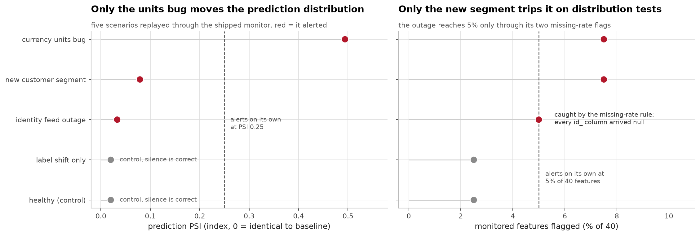
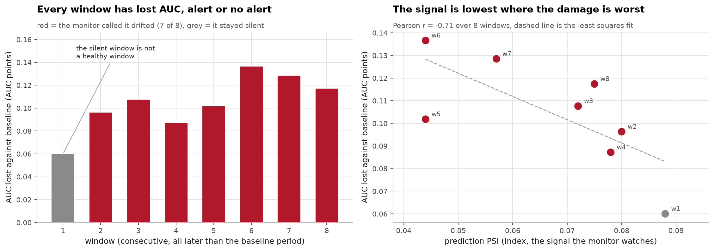
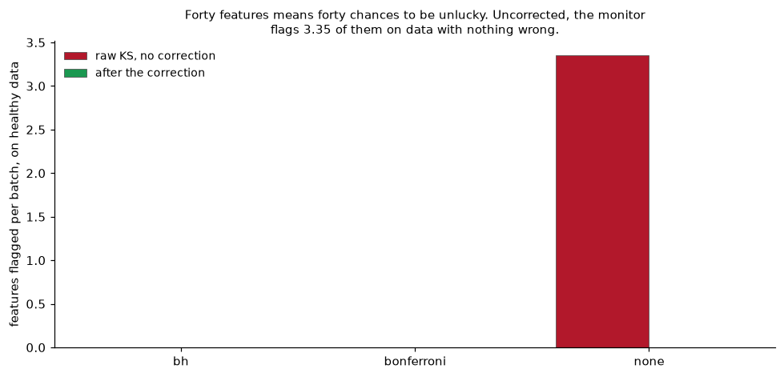
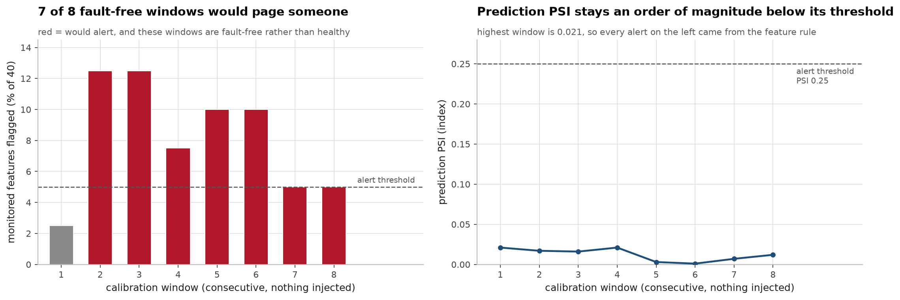
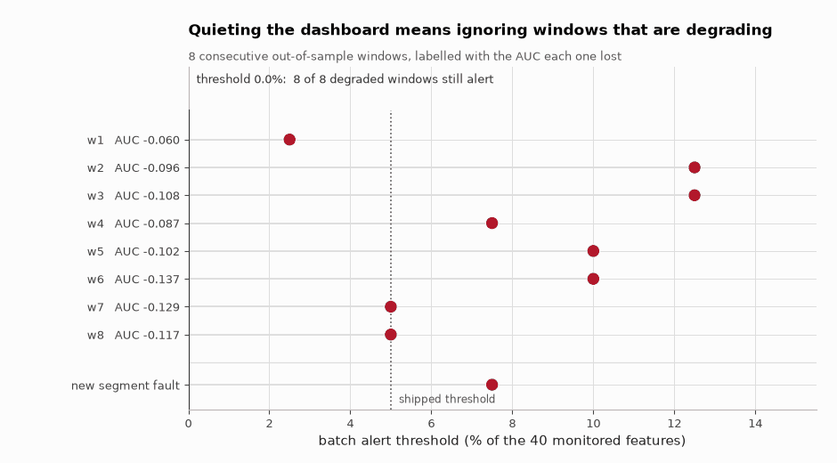

# Production ML pipeline, with the monitoring actually tested

[](https://github.com/aghasalim/mlops-fraud-pipeline/actions/workflows/ci.yml)
[](https://www.python.org/)
[](LICENSE)
[](https://doi.org/10.5281/zenodo.23003664)

This takes the fraud model from [ieee-fraud-ml](https://github.com/aghasalim/ieee-fraud-ml)
and serves it behind FastAPI. It's versioned and gated by CI, and there's a
monitor watching it.

I don't trust a monitoring dashboard that nobody has broken on purpose. So the
main thing to read here is [INCIDENT.md](INCIDENT.md). It goes through what I
broke and whether the monitor caught it, including the misses it only caught
after I fixed it. Between the two documents I quote about sixty figures. The
code in `verify/` traces every one back to `reports/`, in C, Java, Rust, Go, R,
SQL and JavaScript. If a number in the prose stops matching the report it came
from, the build goes red. That way this document can't quietly go stale.

---


---

## Abstract

It's a fraud model behind FastAPI with CI gating and drift monitoring. I also
wanted to check whether the drift monitoring is worth having at all.

I injected three failure scenarios into the serving data, and the monitor
catches all three. Two controls run beside them. One is an untouched batch and
the other is a pure label shift. Neither gets flagged, so there are no false
alarms. The label-shift control is the one that tells you something. It changes
which transactions are fraudulent without touching any input distribution. A
monitor that watches features is blind to that by design, and no threshold
setting fixes it.

The more awkward result came from eight held-out windows. Over those, the
correlation between the drift signal and the actual AUC degradation is
negative, about −0.71. The window with the largest degradation has one of the
lowest PSI values. The window with the highest PSI has the smallest drop. So on
this data the signal points the wrong way, and I'd want to know that before
wiring it to a pager.

I did get the false alarms under control, just not with the mechanism I built
for them. Testing forty features per batch gives you forty chances to be
unlucky. On healthy data a bare KS test flags 3.35 features per batch. The PSI
effect-size gate is what removes those. With the gate on and no correction at
all, healthy batches flag 0.0 features. Benjamini-Hochberg and Bonferroni also
sit at 0.0, so on this data there's nothing left for them to do. Finding 2 in
section 1 has the details.

Here's what I think the repo adds. (i) Injected-failure scenarios, with the
misses reported and none tuned away. (ii) A direct comparison of the drift
signal against measured degradation. (iii) A healthy control that measures the
false-alarm rate. (iv) A deployment gate that blocks on model checks rather than
a metric threshold.

---

I haven't committed the baseline profile. It holds a 20,000 row reference
sample of IEEE-CIS features, and that competition data isn't mine to
redistribute. So `artifacts/baseline.json` is gitignored, and you rebuild it
from your own copy of the raw csvs. Serving works without it, but monitoring
doesn't.

## 1. The short version

3 of 3 injected failures caught, 0 false alarms on 2 controls. That's the
result the brief asks for, and it's the least interesting thing I found.

These are the three findings I'd actually want to be asked about.

1. My detector was broken before I injected anything. Testing turned up three
bugs. The worst showed up when I simulated the identity provider going down,
with every `id_*` column arriving null. The monitor reported healthy. A KS test
drops non-finite values, so a 100%-null column has nothing left to compare and
scores PSI 0. The most conspicuous failure you could have in production gave a
*cleaner* report than normal traffic.

2. The multiple-testing correction I built isn't what fixes false alarms.
I split identical data into two random halves. On those, KS testing alone flags
3.35 of 40 features. That's the 5% you asked for, showing up as noise forever.
I added Benjamini-Hochberg to deal with it. What actually removes them is the
PSI effect-size gate, which needs a shift to be *large* and not just
detectable. Once that's in place, BH and Bonferroni have nothing left to do. I
built the correction thinking it was the answer, and it wasn't.

3. Prediction drift points the wrong way. Across eight windows of real
traffic the model loses 0.060 to 0.137 AUC. Nothing is broken there, it's
just time passing. Prediction PSI correlates −0.709 with that loss. So the
output distribution looks most stable exactly where the model is doing worst.
With n=8 that's only suggestive. Still, the direction alone kills the idea that
"predictions look normal, so we're fine."

---

## 2. What the monitor did





The right-hand panel is the uncomfortable one. If the drift signal tracked
degradation, these points would rise. They fall instead, at a correlation of
−0.71. I'd say a monitor whose signal is anti-correlated with the harm it's
meant to detect is worse than no monitor, because it eats attention.







*Same eight windows. The only thing moving is the alert threshold. The windows
and the injected new segment fault stay put, and once the threshold passes 7.5%
the fault stops alerting too.*

| scenario | caught? | how |
|---|---|---|
| healthy (control) | **no**, correct | correct, 1/40 features, prediction PSI 0.020 |
| currency units bug | **yes** | prediction PSI **0.494** |
| new customer segment | **yes** | 3/40 features, `card1_freq` PSI 0.564 |
| identity feed outage | **yes** | `id_31` missing rate **+100%** |
| label shift only | **no**, correct | correct by construction |

The last row is a negative control, and it's meant to be missed. It only
changes which transactions are fraudulent and leaves every input untouched. No
input-distribution monitor can see that, and this one doesn't either. I kept it
in the list because a scenario set where everything gets caught tells you
nothing about where the system is blind.

The missing-rate rule is what catches the outage. It now also sits exactly on
the 5% feature-share line, 2/40. Both of those features are ones the
missing-rate rule flagged, though. Since the fully-null fix, a column that goes
dark from mostly null counts as well as `id_31`. KS and PSI flag none of them,
and prediction PSI is 0.033. Without the missing-rate rule it would sail
through.

---

## 3. Running it

```bash
make setup && make test
```

There are 21 tests. The drift tests encode bugs that really shipped, so they'll
fail if any of those come back.

```bash
make serve
```

Then `curl -X POST localhost:8000/predict -H 'content-type: application/json' -d '{"TransactionAmt": 120.0}'`

To reproduce the experiments you need the IEEE-CIS data. The Kaggle fetch is
in [ieee-fraud-ml](https://github.com/aghasalim/ieee-fraud-ml). Point
`IEEE_DATA` at it and run

```bash
make validate && make simulate && make dashboard
```

---

## 4. How it fits together

| piece | choice | why |
|---|---|---|
| serving | FastAPI + Pydantic | request validation is a monitoring surface: a negative amount is a 422, not a prediction |
| container | Docker, non-root, healthcheck | a process reachable from the network is the last place to run privileged |
| registry | MLflow (SQLite backend) | the file store is in maintenance mode and now raises outright |
| gate | `registry.py` exits non-zero | CI depends on the gate as a *job dependency*, not a check mark someone is trusted to read |
| drift | KS + PSI + missing-rate | significance, effect size, and the thing distribution tests are blind to |
| monitored set | top 40 by gain importance | monitoring all 443 adds noise and alert slots, not coverage |

The deploy gate really blocks, and there are tests that prove it. A gate that
has only ever returned `true` looks exactly like no gate. So `test_gate.py`
feeds it four bad models and asserts each one is rejected. One has AUC 0.60 and
another was trained on 1,000 rows. The other two have a doubled feature count
or fail to load.

---

## 5. Limitations

I'm listing these because a monitoring write-up without its limits is just
marketing.

- No labels, so no direct performance monitoring. The most important signal is
  missing. Everything here is a proxy for it, and finding 3 is evidence the
  proxy is weak.
- Concept drift is invisible. The negative control shows that.
- It's batch, not streaming. Detection latency is one batch.
- Training/serving skew is unguarded. `featurize.py` re-implements
  transformations that live in another repo. The real fix is a shared library
  or a feature store, and that isn't here.

The full detail is in [INCIDENT.md](INCIDENT.md), including the thresholds I
set wrong in both directions before calibrating them.

## 6. Licence

MIT. The text is in [LICENSE](LICENSE).

## References

I cite three papers, and each one is used here. Sculley et al. is the failure
taxonomy the design answers to. LightGBM is the model that's actually served,
and Rabanser et al. is the drift method that's actually run.

- **Sculley, Holt, Golovin et al. Hidden Technical Debt in Machine Learning Systems. NeurIPS 2015.** the failure modes the gating and monitoring here are aimed at.
- **Ke, Meng, Finley et al. LightGBM. NeurIPS 2017.** the served model.
- **Rabanser, Günnemann, Lipton. Failing Loudly. NeurIPS 2019.** [arXiv:1810.11953](https://arxiv.org/abs/1810.11953) the drift detection approach.
